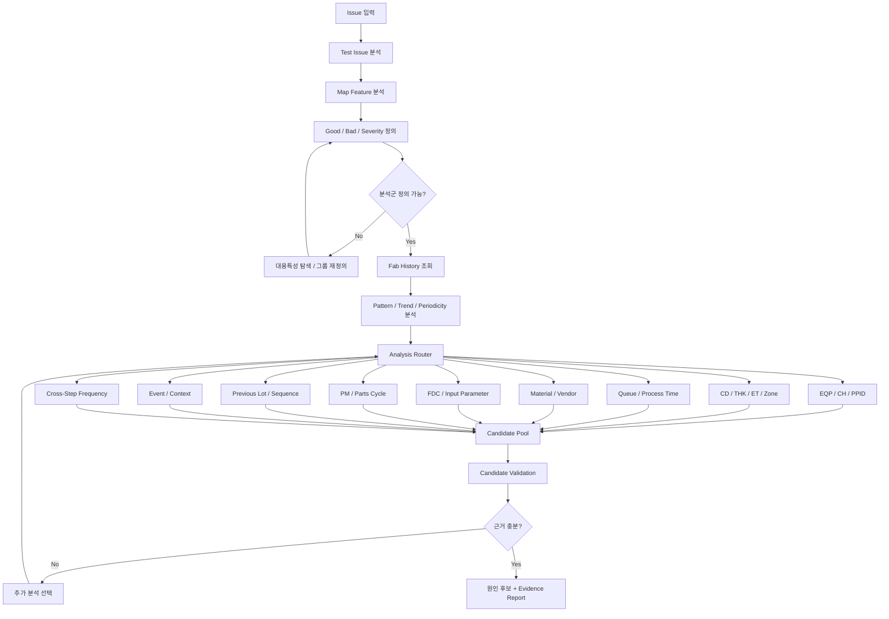

# 반도체 Commonality 분석 개념 및 Graph 설계 정리

> ⚠️ **목표 그림이다. 작업 지시가 아니다.** 과거 사례로 검증되지 않았다.

## 1. Commonality 분석이란

Commonality 분석은 수율 변화, FAB Parameter 중심값/산포 변화, Defect 증가 등 **예측과 다른 이상 결과가 발생했을 때**, 양호 그룹과 불량 그룹을 정의하고 두 집단 간의 차이를 분석하여 **불량 유발 원인을 규명하는 활동**이다.

단순히 불량 Wafer들이 공통으로 사용한 EQP나 CH를 찾는 분석이 아니라, 다음과 같은 다양한 Context를 함께 고려한다.

- 공정 Path
- EQP / CH / PPID
- CD / Thickness / ET 등 계측값
- Parameter / FDC
- Process Time / 정체시간
- Wafer 진행 순서
- 직전 Lot / 직전 Product
- 연속 진행 / 비연속 진행
- Idle 이후 첫 Lot
- PM / Parts 교체 주기
- 원자재 / Vendor
- 특정 Event
- Lot / Wafer / Map 내 주기성
- 여러 Step에서 반복적으로 등장하는 EQP / 조건

즉, Commonality 분석의 핵심은 단순한 **공통점 탐색**이 아니라,

> **불량을 설명할 수 있는 조건의 조합과 그 근거를 찾는 것**

에 가깝다.

---

# 2. 사내 Commonality 분석 기본 Flow

## 2.1 Test Issue 파악

분석 초기에는 Test 단계에서 나타나는 특징을 먼저 확인한다.

예:

- DUT성
- 가로줄성
- Test 장비 의존성
- Test Card 의존성

---

## 2.2 Map 특징 파악

불량 Map의 형태를 확인하고 특징을 정의한다.

### 주요 확인 항목

- 불량 Pattern 이름 정의
- Area성 여부
- Fail Bin Trend 변화
- Random / Area성
- 가로줄 / 세로줄
- Shot성
- Sanding 주기성
- DUT성
- 환형 / Middle 환형
- Edge / Center
- 우상단 / 좌상단 등 위치성
- 회오리 / 바람개비 / 방사형
- 좌우 대칭 / 비대칭
- 규칙적 반복 Area / 불규칙 Area

특정 형상을 표현하기 위한 현업 용어도 존재한다.

예:

- 그믐달
- 두루미
- 환풍기
- 야구공
- 부분일식
- 모래성
- 호빵
- 검버섯
- 빗살
- 횃불
- 두눈
- 부메랑
- 구슬

### 주의사항

- Map 모양만 보고 원인을 추정하는 선입견을 배제한다.
- Area 내부에서도 Bin 구성이 어떻게 변하는지 확인한다.
- Hard fail만 존재하는지, Hard + Margin fail이 혼재하는지 확인한다.

---

# 3. 양호 / 불량 그룹 정의

Commonality 분석에서 가장 중요한 단계 중 하나다.

## 3.1 가능한 분석 단위

- Chip
- Shot
- Wafer
- Lot
- Batch

## 3.2 불량 강도 구분

단순 Good / Bad보다 다음과 같이 세분화하는 것이 유리하다.

- Good
- 약불
- 중불
- 강불

가능하다면 불량 정도를 연속적인 값으로 표현한다.

예:

```text
severity
bad_area_ratio
fail_bin_ratio
edge_bad_ratio
pattern_score
```

단순히

```text
yield < threshold → bad
yield >= threshold → good
```

처럼 이분법적으로 구분하는 것보다 분석력이 높다.

## 3.3 불량 수치화가 어려운 경우

1. 가능한 대용 특성을 찾는다.
   - CD
   - ET
   - Thickness
   - Profile 등

2. 대용 특성도 없으면 최대한 그룹화한다.
   - 양호
   - 약불
   - 중불
   - 강불

3. 작은 Area성 불량처럼 전체 Wafer 불량률에 영향이 적은 경우에는 위치 / 각도 등의 정보도 함께 사용한다.

> 양호와 불량을 명확하게 나눌 수 있다면 Commonality 분석의 절반은 성공한 것과 같다.

---

# 4. FAB 이력 분석

다음과 같은 이력을 확인한다.

- FAB Comment
- EIN / ECN
- 불발통
- 이발통
- Split 이력
- 특이 진행 이력

이는 뒤의 Cause Investigation에서 중요한 Context가 된다.

---

# 5. 규칙성 / 주기성 분석

## 5.1 Lot 내 Wafer 간 주기성

장비 구조에 따라 특정 주기의 불량이 나타날 수 있다.

예:

- Multi CH
  - Dry Etch
  - PEOX
  - HDP
  - Photo
  - Barrier Metal
  - Scrubber

- 1CH Multi Wafer
  - Ashing
  - FSD

- 1CH Multi Chuck / Multi Head
  - WSi
  - CMP

- Wafer Loading 순서에 따른 주기
- TKIN / OUT 시 Wafer 회전 방향
- Wet Clean에서 Wafer 배치 구조

## 5.2 확인 포인트

- Fail률의 2 / 3 / 4 / 5주기
- Measure 값에서의 주기성
- EDS Map 내부 주기성
- 특정 Wafer에서만 발생하는지
- 주기성이 일시적으로 깨지는 시점

특히 **주기성 위반 시점**은 원인을 찾는 중요한 단서가 될 수 있다.

---

# 6. 기초 조사

## 6.1 CD / Thickness / ET

단일 값만 보는 것이 아니라 Trend 기반으로 확인한다.

- 기존 Trend를 벗어나는가?
- 중심값 이동이 발생했는가?
- 산포가 변했는가?
- 변화 시작점이 불량 Lot과 일치하는가?
- 수치가 Target에 가까워졌더라도 갑작스러운 중심 이동이 있는가?

---

## 6.2 CH 분석

- 특정 CH의 실제 사용 여부 확인
- 숨은 CH 존재 여부 확인
- 특정 CH 직전 진행 Lot 확인
- 동일 CH에서 Good / Bad가 공존하는지 확인

---

## 6.3 Zone 분석

Zone은 반드시 절대적인 물리 위치라고 가정하지 않는다.

장비 구조나 Lot 배치에 따라 상대적인 개념일 수 있다.

---

## 6.4 EQP 분석

가장 기본적인 Commonality 분석이다.

하지만 다음을 주의한다.

- 불량 EQP에서도 Good Lot이 나올 수 있다.
- 불량 Lot의 전후 Lot이 Good일 수 있다.
- 동일 EQP라도 직전 Lot, 연속 진행 여부 등에 따라 상태가 다를 수 있다.

따라서 단순 EQP 편향만으로 원인을 확정하지 않는다.

추가 분석:

- EQP별 차이
- EQP Group별 차이
- PPID 변경점

---

# 7. 정체시간 / Process Time 분석

분석 대상:

- Lot 내 Step 간 정체시간
- 특정 EQP에서 전후 Lot 간 정체시간
- Wafer별 Process Time
- Wafer별 Queue / Hold Time
- TKIN 이후 실제 Process 시작까지의 대기시간
- Lot별 전체 Process Time

특히 다음 Pattern은 중요한 단서가 될 수 있다.

```text
Wafer No가 증가할수록 불량 감소
Wafer No가 증가할수록 불량 증가
앞 Wafer 몇 장에서만 불량
```

이 경우 다음과 연결해서 볼 필요가 있다.

- 연속 / 비연속 진행
- Idle 후 첫 Lot
- Previous Lot
- Previous Product

과거 동일 수준의 정체 Lot이 정상이라고 해서 현재 정체시간 영향을 배제해서는 안 된다.

---

# 8. 원자재 분석

예:

- PR
- Thinner
- Chemical
- Wafer Vendor

특히 동일한 형태의 불량이 여러 EQP에서 동시에 발생한다면 공통 원자재를 의심할 수 있다.

---

# 9. Input Parameter / FDC / Maintenance

관리 항목이 아니거나 Spec 안에서 움직이는 Parameter도 원인이 될 수 있다.

주요 분석:

- Wafer별 Process Time
- Wafer별 정체시간
- FDC / ERD Trend
- Input Parameter
- Parts 교체주기
- PM 주기

EQP 간 차이가 없어도 PM / Parts Cycle에 따라 Good / Bad가 반복되는 경우가 있을 수 있다.

---

# 10. 정황 분석

단순한 EQP / Parameter 차이가 아니라 **특정 상황에서만 발생하는 조건**을 찾는다.

대표 예:

- Diff 상위 Zone의 특정 Lot 영향
- 특정 Product 진행 직후 Lot
- 특정 Process 진행 직후 Lot
- Wet Process에서 동일 Batch Lot 영향
- 특정 이력을 가진 Lot
- EQP Idle 이후 첫 Lot
- Product Group 전환 후 첫 Lot
- 특정 Event 직후

이 영역은 현업 경험과 Context가 특히 중요하다.

---

# 11. 빈도 분석

특정 EQP가 여러 Step에서 반복적으로 불량과 함께 등장하는지 확인한다.

단순한 Step × EQP Commonality에서 원인을 찾기 어려울 때 유용하다.

예:

```text
Step A → EQP03
Step B → EQP03
Step F → EQP03
```

처럼 동일 EQP가 여러 Step에서 반복적으로 등장한다면 장비 자체 또는 장비 상태와 연계된 문제일 수 있다.

---

# 12. Commonality 분석을 Graph로 만드는 방향

사내 자료의 1~11 순서는 분석 사고의 기본 Flow로 활용할 가치가 크다.

다만 이를 그대로

```text
1 → 2 → 3 → 4 → ... → 11
```

형태의 직렬 Workflow로 만드는 것은 적절하지 않다.

왜냐하면 11개 단계의 성격이 서로 다르기 때문이다.

---

# 13. 3개의 Layer로 재구성

## Layer 1. Problem Definition

거의 모든 분석이 반드시 통과해야 하는 구간이다.

```text
Test Issue
    ↓
Map Feature
    ↓
Good / Bad / Severity 정의
```

### 핵심 State 예

```python
state["target"] = {
    "good_group": ...,
    "bad_group": ...,
    "severity": ...,
    "target_level": "wafer",
}
```

Good / Bad 그룹이 제대로 정의되지 않았다면 뒤의 Commonality 결과도 신뢰하기 어렵다.

따라서 이 부분은 **Gate 역할**을 하는 것이 적절하다.

---

# 14. Layer 2. Feature / Hint Extraction

FAB History와 Pattern 분석을 통해 **어떤 분석을 먼저 해야 할지 판단하기 위한 단서**를 수집한다.

예:

```python
state["hints"] = {
    "periodicity": 5,
    "wafer_no_dependency": True,
    "area_pattern": "edge",
    "directionality": False,
    "single_wafer_issue": False,
}
```

이 Layer의 목적은 원인을 직접 확정하는 것이 아니라,

> 어떤 Cause Investigation을 먼저 수행해야 하는가?

를 결정하는 것이다.

---

# 15. Layer 3. Cause Investigation

Hint를 바탕으로 필요한 분석으로 분기한다.

```text
                 ┌─ EQP / CH / PPID
                 ├─ CD / THK / ET / Zone
                 ├─ Queue / Process Time
Problem Hint ────┼─ Material / Vendor
                 ├─ FDC / Input Parameter
                 ├─ PM / Parts Cycle
                 ├─ Previous Lot / Sequence
                 ├─ Event / Context
                 └─ Cross-Step Frequency
```

이 구간에서는 모든 분석을 무조건 실행하는 것보다 **Hint 기반 우선순위 분석**이 적절하다.

---

# 16. Hint에 따른 분석 Routing 예

## Case 1. 5 Wafer 주기 발견

```text
Map / Fail Trend
      ↓
5주기 발견
      ↓
장비 구조 확인
      ↓
Multi Wafer / Multi CH 여부
      ↓
Wafer No × EQP / CH
      ↓
Process Time / Loading Sequence
```

---

## Case 2. 방향성을 가진 Area 불량

```text
Map 분석
   ↓
Area + 방향성 확인
   ↓
EQP / CH
   ↓
Zone
   ↓
Wafer Orientation
   ↓
Loading / Unloading 방향
```

---

## Case 3. Lot 앞쪽 Wafer만 불량

```text
Wafer No Dependency
       ↓
Queue Time
       ↓
Process Time
       ↓
Previous Lot
       ↓
연속 / 비연속
       ↓
Idle → First Lot
```

---

## Case 4. 여러 EQP에서 같은 Pattern 발생

```text
Multiple EQP
    ↓
공통 Material
    ↓
공통 Recipe / PPID
    ↓
Upstream Process
    ↓
Batch / Vendor / Event
```

---

# 17. Candidate 기반 분석 구조

Commonality 결과에서 유의한 조건이 발견되더라도 즉시 원인으로 확정하지 않는다.

예:

```python
candidate = {
    "type": "eqp_ch",
    "step": "ETCH01",
    "eqp": "EQP03",
    "ch": "CH2",
    "evidence": {
        "bad_exposure": 0.82,
        "good_exposure": 0.13,
    },
}
```

이 조건은 **원인 후보(Candidate)** 로 등록한다.

---

# 18. Candidate Validation

Candidate를 반증하는 방향으로 추가 분석을 진행한다.

예:

```text
EQP03 / CH2 후보
        ↓
전후 Lot 확인
        ↓
동일 CH의 Good Lot 존재?
        ↓
Process Time 차이?
        ↓
PM / Parts Cycle?
        ↓
Previous Lot?
        ↓
Parameter 차이?
```

즉,

```text
공통점 발견
    ↓
원인 확정 X
    ↓
Context 추가
    ↓
반례 확인
    ↓
근거 강화 / 후보 제거
```

구조가 된다.

이는 현업 Commonality 분석 방식과 잘 맞는다.

---

# 19. 전체 Graph 구조



---

# 20. Graph의 핵심 구조

전체 구조는 다음과 같이 요약할 수 있다.

```text
Problem Definition
        ↓
Feature / Hint Extraction
        ↓
Analysis Router
        ↓
Cause Investigation
        ↓
Candidate Pool
        ↓
Candidate Validation
        ↓
Evidence 평가
        ↓
추가 분석 필요?
     ↙       ↘
   YES       NO
    ↓         ↓
재분석      Report
```

즉,

> **Spine + Branch + Loop**

구조다.

---

# 21. Analysis Router 설계 원칙

Router를 LLM에게 완전히 맡기는 것은 피하는 것이 좋다.

현업 Know-how 중 명확한 규칙은 결정론적인 Rule로 만든다.

예:

```text
5주기 발견
→ Wafer Sequence / Equipment Structure 분석 우선

Lot 앞장 집중
→ Queue / Process Time + Previous Lot 분석 우선

여러 EQP에서 동일 Pattern
→ Material / Common Recipe / Upstream Process 분석 우선

특정 EQP 편향
→ EQP → CH → PPID → FDC 분석 우선

Idle 이후 첫 Lot
→ Sequence / Context 분석 우선
```

이러한 Rule은 사내 분석 경험을 그대로 코드화할 수 있다.

LLM은 다음 역할에 집중하는 것이 좋다.

- 발견된 Evidence 요약
- Rule로 표현하기 어려운 Hint 해석
- 다음 분석 후보 제안
- 여러 Candidate의 관계 설명
- 최종 분석 Report 생성

---

# 22. 결정론적 코드와 LLM의 역할 분리

## 결정론적 코드가 담당할 영역

- Good / Bad 그룹 생성
- Severity 계산
- EQP / CH Exposure 계산
- 통계적 유의차
- Trend / Change Point 계산
- Periodicity 계산
- Process Time / Queue Time 계산
- Previous Lot 탐색
- PM / Parts Cycle 계산
- Candidate 생성
- Evidence 저장

## LLM이 담당할 영역

- 분석 결과 해석
- 다음 분석 방향 판단
- Pattern 간 의미 연결
- Evidence 설명
- Report 작성

핵심 Ground Truth는 가능한 한 기존 코드와 데이터 분석 함수가 만든다.

---

# 23. 최종 Report의 형태

분석 결과가 단순히

```text
EQP03이 의심됨
```

정도로 끝나면 실제 원인 분석에 활용하기 어렵다.

다음과 같이 Candidate와 Evidence가 함께 제공되어야 한다.

```text
Candidate
EQP03 / CH2

Evidence
- Bad Group 사용률: 82%
- Good Group 사용률: 13%
- Bad Severity 평균 증가
- Wafer No 1~3에서 집중
- 비연속 진행 비율 높음
- Previous Product X 비율 높음
- Process Time 정상 대비 증가

Counter Evidence
- EQP03 / CH2에서도 일부 Good Lot 존재
- PM Cycle만으로는 설명되지 않음

Next Check
- Previous Lot의 Recipe 확인
- CH2 FDC Parameter 비교
```

따라서 최종 시스템은 단순 원인 Ranking보다

> **Candidate + Evidence + Counter Evidence + Next Check**

구조를 가지는 것이 좋다.

---

# 24. 최종 정리

사내 Commonality 분석 자료의 1~11번 순서는 버리는 것이 아니라 **분석 사고의 기본 Spine**으로 활용한다.

다만 실제 구현에서는 다음과 같이 바꾸는 것이 적절하다.

```text
사내 분석 Flow
        ↓
Problem Definition
        ↓
Hint Extraction
        ↓
Rule 기반 Analysis Routing
        ↓
필요한 Cause Investigation만 실행
        ↓
Candidate 생성
        ↓
Context 기반 Validation
        ↓
반증 / 추가 분석 Loop
        ↓
Evidence 기반 최종 Report
```

결국 목표는 단순한 Commonality 계산기를 만드는 것이 아니라,

> **숙련 엔지니어가 불량을 보고 어떤 순서로 의심하고, 어떤 데이터를 확인하고, 어떤 후보를 배제하면서 원인을 좁혀가는지 그 사고 과정을 Graph로 구현하는 것**

이다.
